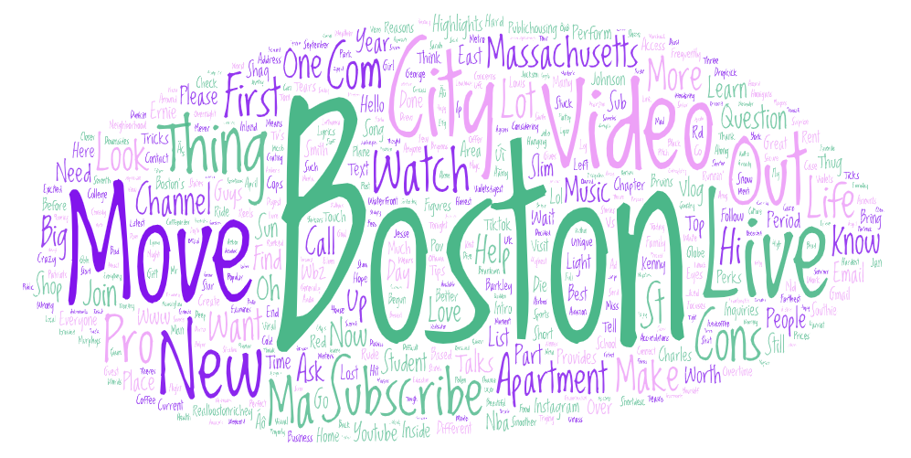
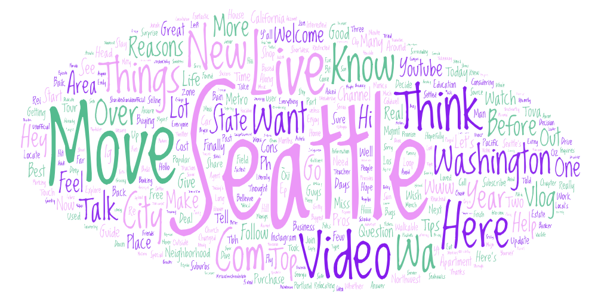

# webdata_collection_wordcloud

### Topic
The topic I selected for this lab is comparing the potential reasons and migration trend in three major cities: Seattle, New York, and Boston.
I want explore the dynamic of urban migration in major cities in the U.S. Each of the three cities I chose has its distinct cultural, which can help to understand the factors influencing people's decisions to move. 
Data was collected using search terms on YouTube. The following Python snippet shows the parameters used for searching New York:
```python
# The URL where the data will be collected from.
search_terms = ["career in new york", "settle in new york", "move to new york"]
for search_term in search_terms:
    url = "https://www.youtube.com/results?search_query=" + search_term.replace(" ", "+")
 ```
 Similar search terms were used for Boston and Seattle.

### Comparison of Word Clouds





Some common words such as "video", "move", "city", and "watch" appear across all word clouds. These common words highlight the topic that I was searching about. There are also some difference between each word cloud. For example, there are words such as "student" and "school" that appears repeatedly in the search result of boston, which aligns with the education environment in Boston. Some unique words such as "dream", "high", "spend", "worker" appear in the new york wordcloud, which aligns with the high speed living style in New York city. Words such as "metro", "suburb", "outside" appear in the seattle word cloud, which shows the importance of transportation system and the nature attraction in Seattle.

Although the word clouds show the different characteristics of each of the cities, the result is different than what I expected. I was hoping to see some keywords that show the reasons, pros and cons for people to settle down or move to each of the cities. However, from the word clouds, it is hard to tell the specific reasons or factors that influence people's choice to move to those cities, which really surprises me. I think that the possible reason is that the information is extracted from Youtube, where there might be a lack of contents that actually talks about the topic I was searching for, and the contents in the video titles and brief descriptions probably do not contain detailed or takeaway information. For future reasearch, I think that I can try to use other content platforms besides Youtube videos to extract information, and also to try different keywords that might give a more useful result.


**Result Spreadsheets:**
- [Boston csv file](assets/boston_dataset.csv)
- [New York csv file](assets/newyork_dataset.csv)
- [Seattle csv file](assets/seattle_dataset.csv)
